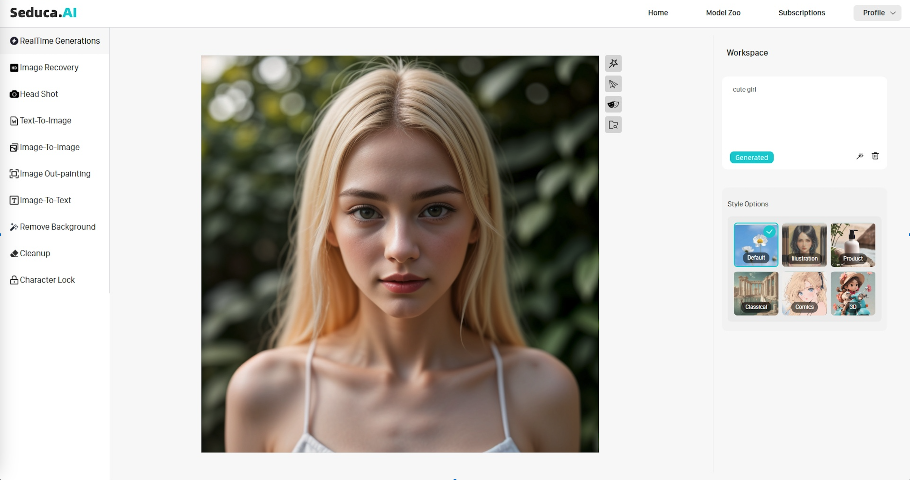

# Seduca_Windows



just typing key words like "cute girl",

without any parameter tweaking, without any strange prompt tags.
## *Seduca*
Seduca is an image generating software .

Seduca has simplified the installation. After you Login and generating the first image, you need to download the nessary models, and you can easily get your image with only using mouse. Minimal GPU memory requirement is 4GB.

For the detailed configuration of the software, watch the Configuration


## *Configuration*

| Operating System | GPU | Minimal GPU Memory | Minimal System Memory | Disk Space | System Version |
|-------|-------|----------|----------|----------|----------|
| Windows | Nvidia RTX 4XXX | 4GB | 8GB | 40GB | Windows10(64) or Windows11 |
| Windows | Nvidia RTX 3XXX | 4GB | 8GB | 40GB | Windows10(64) or Windows11 |
| Windows | Nvidia RTX 2XXX | 4GB | 8GB | 40GB | Windows10(64) or Windows11 |
| Windows | Nvidia RTX 1XXX | 4GB | 8GB | 40GB | Windows10(64) or Windows11 |
| Windows | Nvidia GTX 900 | 4GB | 8GB | 40GB | Windows10(64) or Windows11 |
| Windows | AMD RX560 | 4GB | 8GB | 40GB | Windows10(64) or Windows11 |

## *Install*

You can directly download Seduca with:

# [>>>Click here to download<<<](https://www.google.com)

After you download the file, please uncompress it and then run the 'Seduca.exe'

## *Explain*

The first time you launch the software, you need download the base model to use the module:

>1.It will download default model to the folder "Seduca\main\Seduca\models\". You can download them in advance if you do not want automatic download.
>
>2.The output image default to the folder "Seduca\outputs\". You can find all the images you create in history, and better to copy it, not delete or cut, because out history record need to read these images.
>
>3.The error log file is on "C:\user\your user name\AppData\Roaming\seduca\logs\"
>

## *Thanks*

Special thank to Fooocus for the amazing works.

## *Localization/Translation*

### We need your help! 
 
Please help translate Seduca into international languages.

You can put json files in the language folder to translate the user interface.

For example, below is the content of Seduca_Windows/language/example.json:

```
{
  "Generate": "generieren",
  "Text to Image": "Texte transformé en image",
}
```
You can create a new branch and add the translation file.

If you add --language example arg, Seduca will read Seduca_Windows/language/your file.json to translate the UI.
